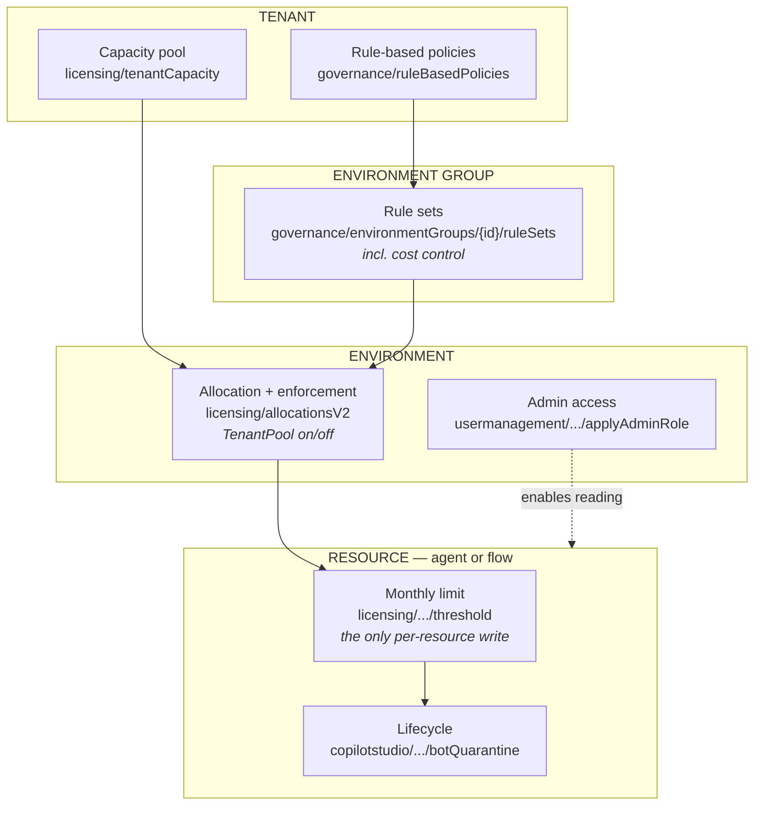
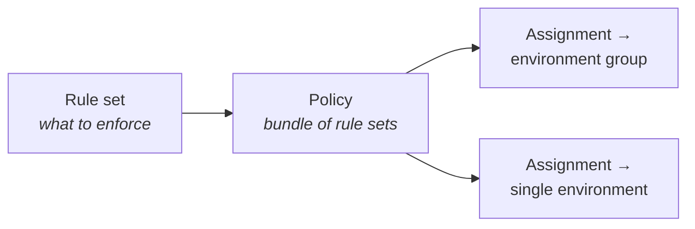
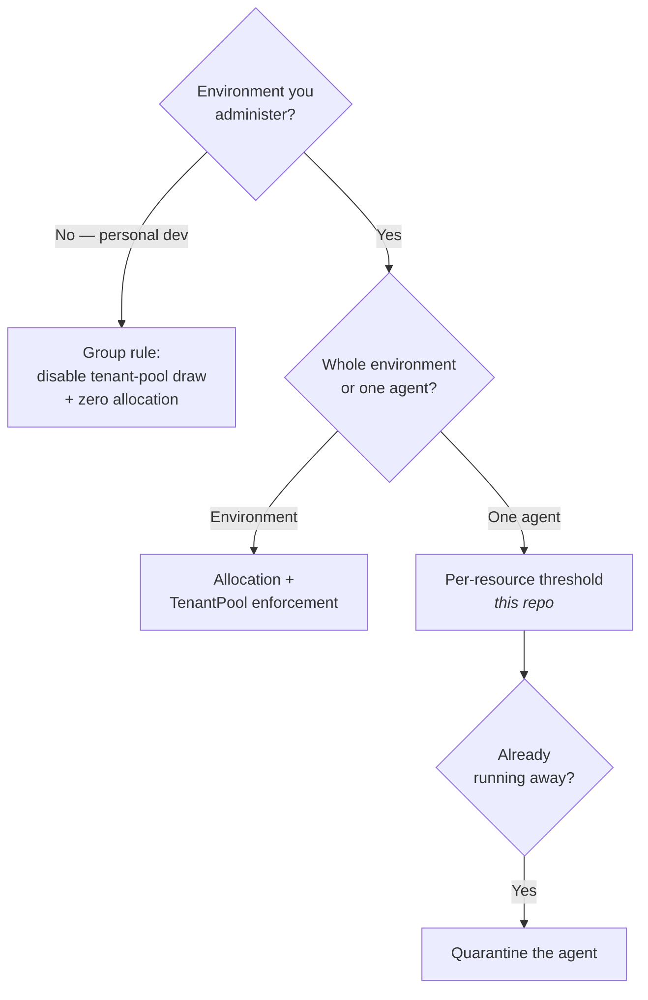

# Power Platform API — a governance-oriented map

How the four namespaces this repo relies on fit together, what each one is *for*, and which
operations actually change something.

All calls share one host and one auth scope:

```
https://api.powerplatform.com/{namespace}/...?api-version=2024-10-01
scope: https://api.powerplatform.com/.default
```

Specs live at
[MicrosoftDocs/power-platform/.../developer/reference](https://github.com/MicrosoftDocs/power-platform/tree/main/power-platform/developer/reference).
The `.json` files carry request examples and field descriptions that the rendered Learn pages drop —
prefer them.

---

## The four namespaces at a glance

| Namespace | Answers the question | Ops | Writes? |
| --- | --- | --- | --- |
| **licensing** | Who gets how much capacity, and what happens when it runs out? | 47 | Allocations, thresholds, billing policies |
| **governance** | What rules apply to which environments? | 20 | Policies, rule sets, assignments |
| **copilotstudio** | How do I control an individual agent's lifecycle? | 14 | Quarantine, reassign, delete |
| **usermanagement** | How does an admin get *into* an environment they don't belong to? | 1 | One operation |

### How they nest



Read it as nested containment: tenant capacity flows into environment allocations, group rules
constrain those allocations, and per-resource thresholds constrain individual agents inside an
environment. **Each layer can only tighten what the layer above allows.**

---

## licensing — capacity and money

The largest namespace. Four distinct jobs.

### 1. Allocation — how much capacity an environment gets

```
PUT   /licensing/allocationsV2                      ← set an environment's allocation
GET   /licensing/allocationsV2/availability         ← what's left to allocate
GET   /licensing/allocationsByEnvironment           ← all environments at once
PATCH /licensing/environments/{envId}/allocations   ← per-environment update
```

The allocation body carries **enforcement rules**. The one that matters for governance is
`TenantPool`:

| `TenantPool` | Behaviour |
| --- | --- |
| `enabled: true` | After the allocation is spent, keep drawing from unallocated tenant capacity |
| `enabled: false` | Hard stop at the allocation |

This is the API behind **"Draw from the available capacity in my tenant"**, and the single most
effective control for personal developer environments.

### 2. Thresholds — per-resource monthly limits

```
PUT /licensing/environments/{envId}/entitlements/{entId}/resources/{resourceId}/threshold
GET /licensing/entitlements/{entId}/resourceThresholds
```

**This `PUT` is the only per-resource write in the entire namespace** — and it is what this repo
automates. Body (`ResourceThresholdModel`):

| Field | Type | Meaning |
| --- | --- | --- |
| `limit` | number | Monthly credit limit |
| `notificationThreshold` | integer | **Percentage 1–100**, not a credit count |
| `notifyIfOverCapacity` | boolean | Alert when exceeded |
| `stopIfOverCapacity` | boolean | Hard stop at the limit |
| `stopResource` | boolean | `true` disables the resource immediately |

`entitlementId` for Copilot Credits is `MCSMessages`.

> **Gotcha:** `resourceThresholds` is **tenant-wide**. Every record carries its own `environmentId`,
> so match on `environmentId` **and** `resourceId`. Matching on `resourceId` alone lets a threshold
> from one environment be mistaken for another's.

### 3. Consumption reads — who spent what

```
GET /licensing/entitlements/{entId}/resources                       ← all resources, all environments
GET /licensing/entitlements/{entId}/environments/{envId}/resources  ← one environment
GET /licensing/entitlements/{entId}/users                           ← per user
GET /licensing/entitlements/{entId}/users/{userId}/resources        ← one user's resources
GET /licensing/entitlements/{entId}/resources/{resourceId}/users    ← one resource's users
```

**All read-only.** There is no per-user *write* anywhere in the namespace — which is why per-user
credit caps cannot be automated through this API today.

### 4. Billing policies — pay-as-you-go plumbing

```
POST /licensing/billingPolicies
POST /licensing/billingPolicies/{id}/environments/add
```

Links environments to an Azure subscription for PAYG billing.

> A billing-policy **budget only sends alerts. It does not stop consumption.** Do not mistake it for
> a cap.

---

## governance — rules over groups of environments

The API behind **Manage → Environment groups → Rules**.



```
POST /governance/environmentGroups/{groupId}/ruleSets
POST /governance/ruleBasedPolicies
POST /governance/ruleBasedPolicies/{id}/environmentGroups/{groupId}/assignments
GET  /governance/ruleBasedPolicies/environments/{envId}/assignments   ← what applies here
```

Rule set types in the published spec: `Sharing`, `AdminDigest`, `SolutionChecker`,
`MakerOnboarding`, `Lifecycle`, `Copilot`, `CrossGeoCopilotDataMovement`, `GenerativeAISettings`,
`CopilotAuth`, `FlowAutomationRestrictions`.

**Why this matters for cost:** a rule assigned to a group applies to **every environment in it,
including ones created later**. Personal developer environments are created automatically whenever a
licensed user opens Copilot Studio — so this is the difference between a durable control and a
cleanup you repeat forever.

> A published group rule governing tenant-pool draw **overrides** per-environment settings. Changing
> the environment directly then returns `TenantPoolLockedByPolicy`.

---

## copilotstudio — individual agent lifecycle

Not about money. About stopping or moving a specific agent.

```
POST   /copilotstudio/environments/{envId}/bots/{botId}/api/botQuarantine/SetAsQuarantined
POST   .../SetAsUnquarantined
POST   .../botAdminOperations/reassign     ← change owner
DELETE .../botAdminOperations              ← delete the agent
GET    .../makerevaluation/testruns        ← evaluation history
```

**Quarantine is the emergency brake.** A threshold caps an agent at month end; quarantine stops it
now. The natural escalation for a runaway agent:

```
threshold exceeded  →  notification  →  stopIfOverCapacity  →  quarantine
   (licensing)          (licensing)        (licensing)        (copilotstudio)
```

---

## usermanagement — the admin's way in

One operation. It solves a specific and non-obvious problem.

```
POST /usermanagement/environments/{environmentId}/user/applyAdminRole
```

**The problem:** Power Platform administrator is a *control-plane* role. It lets you manage an
environment — allocate capacity, apply rules, delete it — but it does **not** grant *data-plane*
access to the Dataverse inside it. Agents live in Dataverse. So reading the `bots` table in someone
else's personal developer environment returns **HTTP 403**, and the Copilot Studio portal fails the
same way for the same reason.

**This operation grants the calling account System Administrator in that environment** — what the
admin center does when an administrator opens an environment they don't belong to.

> It is a **persistent privilege change**, including into individual users' personal environments.
> Treat it as a deliberate act, not a default. In this repo it is opt-in via `-ElevateWhenDenied`.

---

## resourcequery — the inventory shortcut

Not one of the four, but worth knowing because it often removes the need to elevate at all.

```
POST /resourcequery/resources/query
```

KQL over Azure Resource Graph — the API behind **Manage → Inventory**. **Control-plane and
admin-scoped**, so it lists resources inside environments you are not a member of, with **one call
for the whole tenant**.

Resource types that can consume Copilot Credits:

```
microsoft.copilotstudio/agents        microsoft.powerautomate/agentflows
microsoft.powerautomate/cloudflows    microsoft.powerapps/canvasapps
microsoft.powerapps/modeldrivenapps   microsoft.powerapps/codeapps
```

| | Dataverse `bots` | Inventory query |
| --- | --- | --- |
| Scope | One environment | Whole tenant, one call |
| Requires environment membership | **Yes** | **No** |
| Sees personal developer environments | Only if you're a member | **Yes** |
| Covers flows | No | **Yes** |

---

## Choosing the right control



| Need | Control | Namespace |
| --- | --- | --- |
| Stop unapproved environments consuming | Tenant-pool draw off + zero allocation | governance + licensing |
| Cap an approved environment | Allocation | licensing |
| Cap one agent | Per-resource threshold | licensing |
| Stop an agent immediately | Quarantine | copilotstudio |
| Cap one **user** | **No API today** — admin centre only | — |
| See inside environments you can't enter | Inventory query, or elevate | resourcequery / usermanagement |

---

## Things that cost me time

1. **The threshold route needs `api-version=1`, not the documented `2024-10-01`.** With
   `2024-10-01` the write returns 200 and persists in `resourceThresholds`, but the limit never
   appears in Manage Agents and does not enforce. That endpoint also accepts a random GUID belonging
   to no resource, so a 200 proves nothing. Verify in the admin center, not by reading the row back.
2. `notificationThreshold` is a **percentage**, restricted to **50-100** by the admin center.
2. `resourceThresholds` is **tenant-wide** — key on `environmentId` + `resourceId`.
3. Date parameters are **camelCase** (`fromDate`). Kebab-case is the `pac` CLI flag spelling and is
   rejected with HTTP 400.
4. `licensing/entitlements/{id}/environments/{envId}/resources` can return **403** for a delegated
   admin token even when the admin center shows the same data.
5. **Power Platform admin ≠ Dataverse access.** Expect 403 on personal developer environments, and
   prefer the inventory query over elevating.
